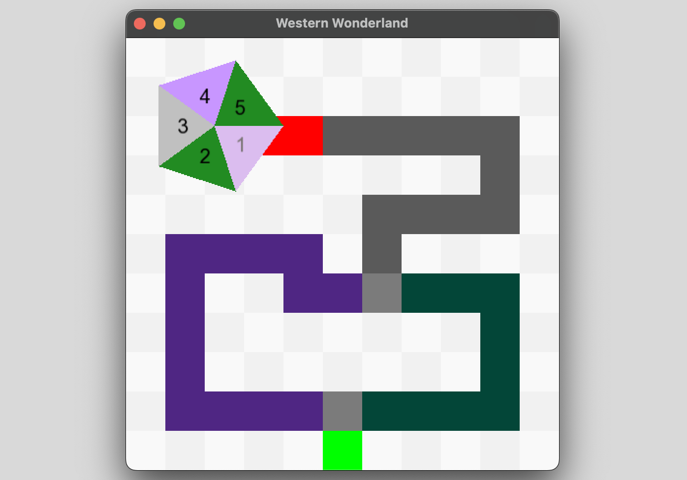

# Running SFML Program with Homebrew

This guide will help you set up Homebrew and run an SFML program on your computer system. Disclaimer, all group members used MacOS for this project.

## Step 1: Installing Homebrew

Run the following command in Terminal to install Homebrew: 
/bin/bash -c "$(curl -fsSL https://raw.githubusercontent.com/Homebrew/install/HEAD/install.sh)"

## Step 2: Install SFML

Run the following command in Terminal:
`brew install sfml`

## Step 3: Setting up and running an SFML Program

To run the code type the following into terminal after you cd into the folder where the code is downloaded:
g++ -o game Events.cpp Game.cpp GameBoard.cpp Graduation.cpp Main.cpp MajorSelection.cpp Player.cpp ResourceDisplay.cpp Wheel.cpp -I/usr/local/Cellar/sfml/2.6.1/include -L/usr/local/Cellar/sfml/2.6.1/lib -lsfml-graphics -lsfml-window -lsfml-system

### Note: If this command gives you an error, try these steps below

1. Run **brew info sfml**
2. Locate the correct path needed (for example some users may get *L/home/linuxbrew/.linuxbrew/Cellar/sfml/2.6.1/lib*)
3. Retry the **g++** command with the correct path to get sfml to run properly

### Finally run the compiled program by executing:

./game

It should look something like this:

# How to Play

Welcome to Western Wonderland -- a Western University adaptation of The Game of Life. We wanted to create a game highlighting our fond university memories throughout the past few years. This game supports 2 players. 

### Instructions:

1. Players will select their major (Western or Ivey), determining their path for the first half of the game, as well as the amount of resources that you start the game with.
2. Throughout the game, GPA, student debt, and happiness will be tracked for each player. The game's goal is to maximize GPA and happiness while minimizing student debt. The winner of the game will be determined based on how many of these categories you 'win'. The winner will be determined once both players reach the end of the board during a graduation event.
3. To spin the wheel, press the spacebar on your keyboard. Players will take turns spinning the wheel, determining the number of spaces their marker moves on the board. Turns will alternate until both players have reached the end of the board.
4. Event spaces are special spaces indicated by colour tiles on the board. Event spaces tell a story about a memorable university experience and affect your in-game resources.

### Keyboard Commands:

I - Select Ivey path
W - Select Western path
Spacebar - Spin wheel
A - Display player 1 resources
B - Display player 2 resources
X - Close resource display popup
